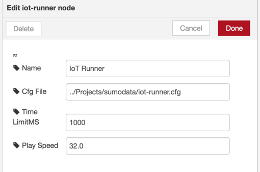
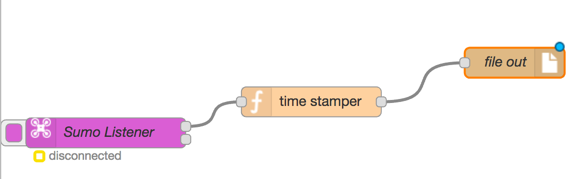
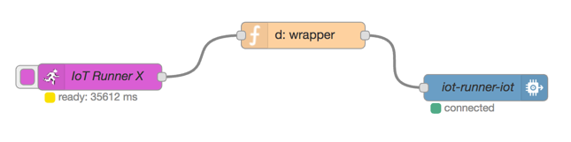
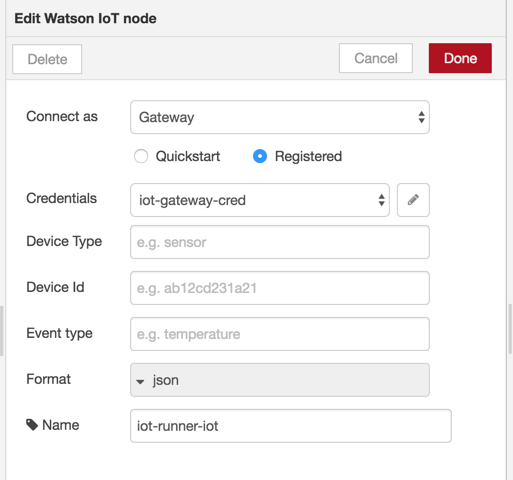

# iot-Runner

This node-red node produces a stream of IoT events from pre-recorded files you provide. It uses one or more iot history files, combines them, and plays them back using timestamps in order to provide a stream that looks like it came from multiple IoT devices operating simultaneously.

IoT device histories can be easily be produced in Node-Red by running any IoT input device through a function that adds a timestamp in milliseconds and then writes each node-red msg to file output. 

Event records should look like this, either with a simple timestamp:

'''{"event":"BatteryStateChanged","percent":"19","timestamp":1491926017998}
{"event":"BatteryStateChanged","percent":"18","timestamp":1491926026876}
'''

Or alternatively like this with timestamp and possibly other data in a metadata field:

'''{"event":"BatteryStateChanged","percent":"19"," metatdata":{"timestamp":1491926017998}}
{"event":"BatteryStateChanged","percent":"18", "metatdata":{"timestamp":1491926026876}}
'''

"d" formatted messages are also supported:

'''{ "d":  { "event": "MassStorageInfoStateListChanged",  "mass_storage_id": 0, "size": 3768, "used_size": 66, "plugged": 1, "full": 0, "internal": 1 }, "timestamp": 1492011009969}
'''

The node requires an configuration file. The config file lists the history files you want to use in the playback. It also sets an iot deviceId and deviceType for each playback file, as well as a time delay for use in staggering the start of the playback of each file. 

A sample iot-runner.cfg file looks liek this:

'''{
"playbacks": [
{"filename": "sensordata1.txt", "deviceType": "C5460", "deviceId": "device_01", "startDelay": 0},
{"filename": "sensordata2.txt", "deviceType": "C5460", "deviceId": "device_02", "startDelay": 1000},
{"filename": "sensordata3.txt", "deviceType": "C5460", "deviceId": "device_03", "startDelay": 2000}
]}
'''

It contains a list of playback definitions each of which contains:
* The name of the pre-recorded playback file, in the same folder as the iot-runner.cfg
* The device type
* The unique device name
* A startDelay indicating the number of milliseconds after playback start for this file to begin playback

During playback, the json object on each line of the history file becomes the msg payload, the timestamp is removed from the payload and moved to the metadata field. A sequential message ID added to the metadata field, as are the deviceID and deviceType. Then everything in the metadata field is added to the IoT msg at playback time and removed from the payload. If there is an event field in the payload, iot-runner will copy it to the message.

A final output message sent to Watson IoT might look like this:

'''{ filename: '/Users/DanT/Projects/sumodata/sumodata2.txt',
  deviceType: 'Sumo',
  deviceId: 'sumo_01',
  startDelay: 0,
  timestamp: 1492011009969,
  event: 'MassStorageInfoStateListChanged',
  eventId: 44,
  payload: 
      { event: 'MassStorageInfoStateListChanged',
        mass_storage_id: '0',
        size: '3768',
        used_size: '66',
        plugged: '1',
        full: '0',
        internal: '1' } ,
  _msgid: 'f53e6d8b.0445' }
'''

## How it Works

iot-runner is an input node, providing multiple messages asynchronously over time until all of the messages in the combined history files from the configuration file have been played back.

During initialization, it reads the configuration file and then reads each history file. The event_reader normalizes the timestamps, treating them as if the first record in each file occurred at time zero. Subsequent history records are treated as offsets from the first record. This is repeated for each history file. When all of the history files have been read their startDelays are added to their respective timestamps, then they are combined and sorted to put them in time order.

When the iot-runner start button is clicked a small number of interval timers are pooled. Each history record is assigned to an available interval time. When a timer expires the associated history record is emitted. The next available history record is assgined and the timer is reused. Currently we use a maximum of 5 timers in parallel.

## Configuration Dialog Settings

The Config Dialog has a path to the config file. Obviously this will only work if you have a file system, something that might not be present on Bluemix. The contents of the config file are described in an earlier section of this MD. In a future version I'd like to make this a file picker, but for now this will have to do.

There is a timelimit, measured in milliseconds. The playbacks will attempt to quiesce sometime after this timer expires. What's actually going on is this timer tells the playback mechanism not to accept new playback records. There may be up to five playback records already queued up, and those, unfortunately, will have to wait until they send their messages. So it will not stop quickly, nor precisely when you asked it to. Also the red status on the node itself will lie to you and tell you it's done, when it might still have five in queue. That's only true if you use the timelimit. 

There is a playback speed multiplier. If you set it to 1 it will playback at the recorded speed. If you set it to 2 it will play back at double speed. If you set it to 0.5 it will play back at half speed. Do not under any circumstances set it to zero as this may cause a singularity.

## Sample Flows

For recording you can do something as simple as this:

The timestamper simply adds these two lines:

'''msg.payload.timestamp = (new Date()).getTime();
return msg;
'''

For playback, you can define your Watson IoT output node as a gateway device. That way all devices it plays back will be automatically accepted by Watson IoT. Sometimes you might want to add a function node in between iot-runner and the Watson IoT output node to handle any additional transformations or add data that you didn't capture initially.

The d: wrapper is optional and adds these two lines:

'''msg.payload = {"d": msg.payload};
return msg;

'''

In the Watson IoT output node, define a gateway and set up the credentials. Then leave the event, deviceType, and deviceId blank. The Watson IoT node will pick these up your configuration and history files.

If you configure your Watson IoT output node as a gateway it is not required for you to register your individual devices on the Watson IoT platform. However, there are benefits in doing so. If the devices are configured you can use the built-in analytics components in Watson IoT and show things happening for each device.

